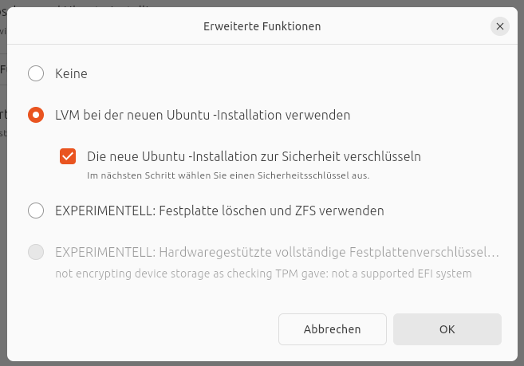
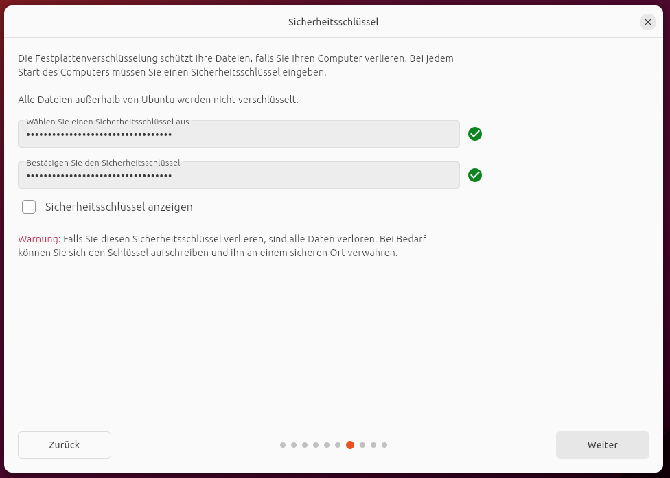
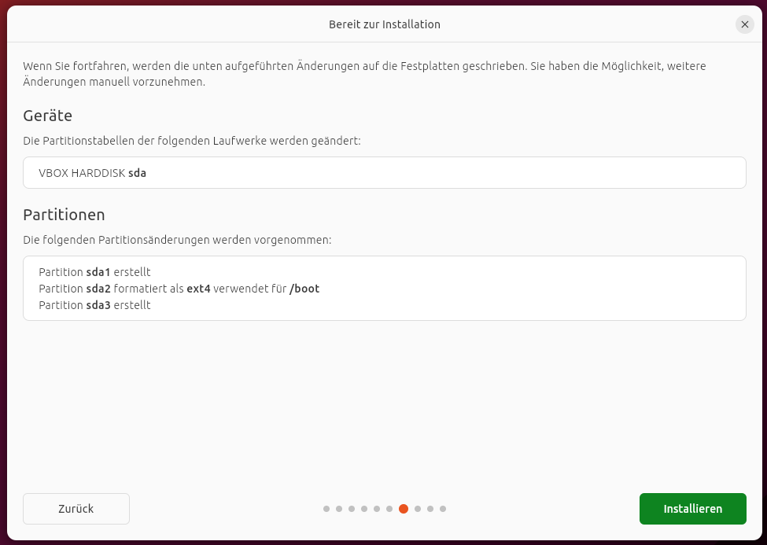
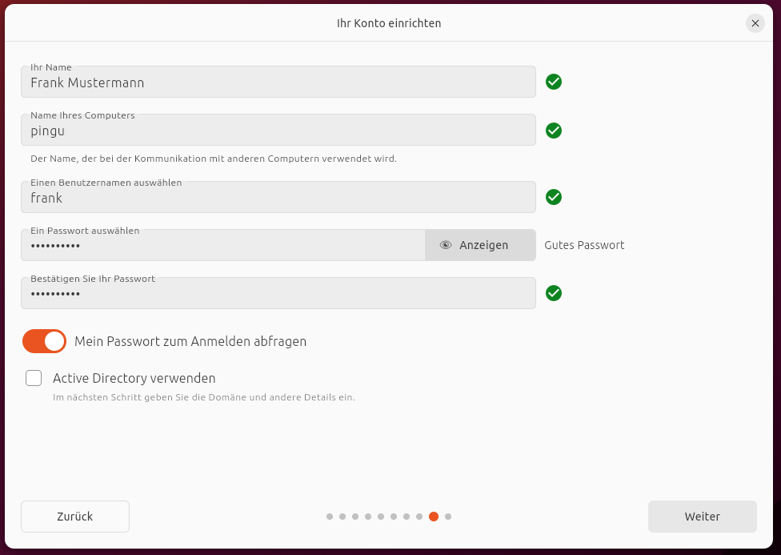
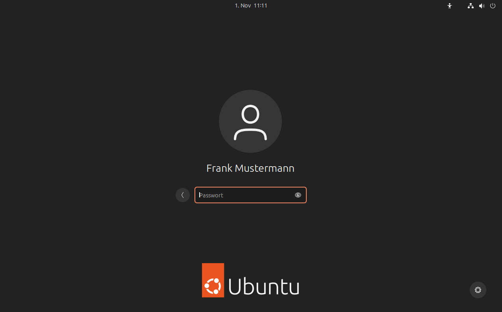
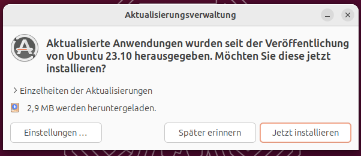
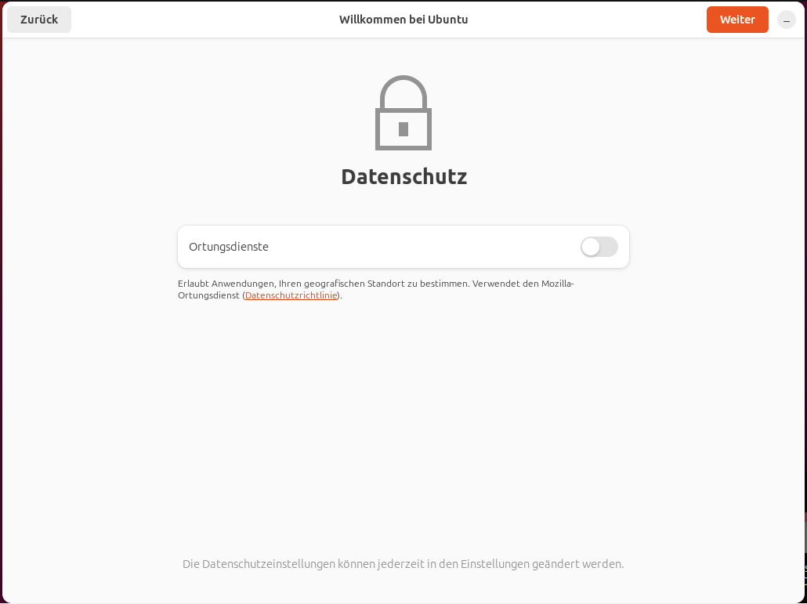

# Installation vom Ubuntu

## USB-Stick erstellen und booten

  1. Laden Sie sich Ubuntu 21.04 von der Webseite [herunter](https://ubuntu.com/#download).
  2. Verwenden Sie [Balena Etcher](https://www.balena.io/etcher/), um einen bootfähigen USB-Stick zu erstellen. Eine Anleitung finden Sie [hier](https://ubuntu.com/tutorials/create-a-usb-stick-on-windows#1-overview)
  3. Booten Sie den USB-Stick. Möglicherweise müssen Sie im BIOS erst das Booten von einem USB-Stick aktivieren oder den Stick in der Boot-Reihenfolge nach oben verschieben.

Wenn Sie den Stick erfolgreich gebootet haben, erscheint GRUB, der Boot-Manager von Linux.

Drücken Sie einfach "ENTER".

## Installation durchführen
### Sprache auswählen

### Tastatur-Layout wählen

### Aktualisierungsoptionen

Wählen Sie "Normale Installation" und setzen Sie die beiden Häkchen für Aktualisierungen und Drittanbieter Software.

### Installationsart

Wenn Sie den Computer vollständig Ubuntu widmen wollen oder eine virtuelle Maschine installieren, ist die erste Option die Richtige. Falls Sie mehrere Betriebssysteme parallel installieren wollen, müssen Sie die zweite Option auswählen und die Festplatte partitionieren.

#### Vollverschlüsselung der Festplatte

Generell bietet es sich an, die Festplatte voll zu verschlüsseln. So sind Ihre Daten sowohl bei Verlust des Computers als auch bei Zugriff durch Strafverfolgungsbehörden oder Kriminelle (oder beides) geschützt. Wählen Sie hierzu den Punkt "Erweitert". Wollen Sie keine Verschlüsselung, so gehen Sie direkt auf "Jetzt installieren".

Haben Sie eine Verschlüsselung gewählt, müssen Sie noch ein Passwort  als _Sicherheitsschlüssel_ festlegen. Wählen Sie hier eine lange und möglichst sichere Passphrase, die Sie sich gut merken können. Diese müssen Sie bei jedem Neustart des Systems eingeben.

Drücken Sie auf "Jetzt installieren".

Sie werden noch einmal gewarnt, dass die ausgewählte Festplattenpartition überschrieben wird.

### Zeitzone

Legen Sie die Zeitzone fest. Normalerweise ist bereits die richtige Zeitzone ausgewählt. Falls nicht, wählen Sie **Berlin**.

### Benutzername und Passwort

Legen Sie Ihren Benutzernamen, Ihr Passwort und den Namen des Computers fest. Wählen Sie ein sicheres Passwort -- "mutti123" ist kein sicheres Passwort.

> Es kann passieren, dass bei der Passwort-Eingabe die Tastatureinstellungen von Ubuntu nicht beachtet werden. In diesem Fall wird eine amerikanische Tastatur benutzt und "y" und "z" sind vertauscht.

### Installation durchführen

Warten Sie, bis die Installation durchgelaufen ist.

### Neustart

Nach Abschluss der Installation drücken Sie auf "Jetzt neu starten".

Wenn Sie dazu aufgefordert werden, entfernen Sie den USB-Stick und drücken Sie "ENTER"-

## Erstmalige Anmeldung

Melden Sie sich mit Ihrem Benutzernamen und Kennwort an. Bevor Sie das Kennwort abschicken, wählen Sie das Ubuntu-Logo unten rechts und setzen Sie die Option auf "Ubuntu on XORG". Dies sorgt dafür, dass für die grafische Oberfläche X11 und nicht Wayland benutzt wird. Dies ist sinnvoll, da Wayland nicht mit allen Programmen einwandfrei funktioniert.

Falls Ihr Passwort nicht funktioniert, könnte der bei der Passwort-Eingabe weiter oben beschriebene Fehler zugeschlagen haben. Versuchen Sie die Buchstaben "y" und "z" zu vertauschen. Sollten Sie dieses Problem haben, setzen Sie Ihr [Passwort neu](setup-password.md).

Möglicherweise bietet Ihnen Ubuntu jetzt an, neuere Updates herunterzuladen. Bestätigen Sie diesen Dialog.

Nachdem die Updates installiert wurden, bietet Ihnen Ubuntu an, Ihre Online-Konten zu verbinden.

Eine Anleitung für das Einrichten der Online-Konten finden Sie [hier](setup-nextcloud.md).

Nach der Einrichtung der Cloud (oder dem Überspringen des Dialoges) werden noch Abfragen zum Datenschutz gemacht.

Geben Sie keine Ortungsdienste frei.

Nach Abschluss der Dialoge ist das System installiert.

Sie sehen den Ubuntu-Desktop.

Die Anordnung der Elemente mag Ihnen etwas seltsam erscheinen. Wie Sie einen Look bekommen, der eher an Windows oder macOS erinnert, ist [hier](setup-gnome.md) beschrieben.

[Zurück](readme.md)