# Evolution

Ein sehr leistungsfähiges Groupware-Programm unter Ubuntu heißt _Evolution_. Es ist bezüglich der Funktionalität in etwa mit Microsoft Outlook vergleichbar.

Starten Sie Evolution. Sollte es noch nicht [installiert](installation-packages.md) sein, können Sie es im Terminal mit dem folgenden Befehl installieren:

```console
sudo apt install -y evolution
```

## E-Mail einrichten

Beim ersten Start zeigt Evolution den Einrichtungsassistenten an. Klicken Sie auf "weiter".


Da Sie keine Sicherungsdatei besitzen, können Sie den nächsten Dialog einfach mit "weiter bestätigen".


Tragen Sie Ihren vollständigen Namen und Ihre E-Mail-Adresse ein und **entfernen** Sie den Haken "Eigenschaften des E-Mail-Servers anhand der eingegebenen E-Mail-Adresse abrufen". Klicken Sie "weiter".


Tragen Sie die Zugangsdaten für den Mailserver der Hochschule ein.

  * Server: `stud.hs-mannheim.de` für Studierende und `mail.hs-mannheim.de` für Mitarbeiter.
  * Port: `993`
  * Benutzername: Ihre Matrikelnummer (für Studierende) oder Ihr zentraler Benutzername (für Mitarbeiter).

Klicken Sie auf "weiter".

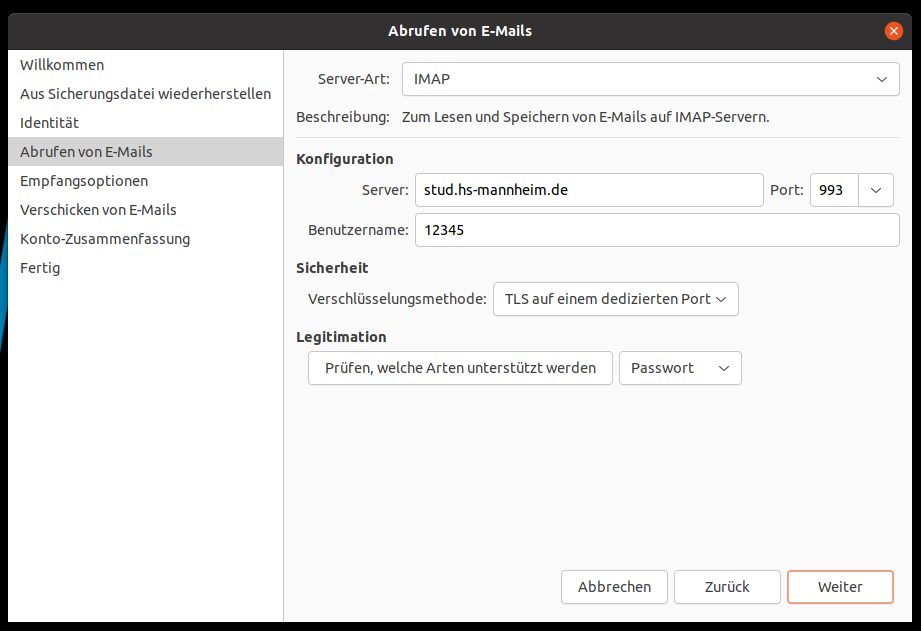

Konfigurieren Sie die Abrufeinstellungen für die E-Mails und gehen Sie auf "weiter".


Für das Versenden der E-Mails geben Sie folgende Daten ein:

  * Server: `stud.hs-mannheim.de` für Studierende und `mail.hs-mannheim.de` für Mitarbeiter.
  * Port: `465`
  * Server erfordert Legitimation: Häkchen setzen
  * Benutzername: Ihre Matrikelnummer (für Studierende) oder Ihr zentraler Benutzername (für Mitarbeiter).


Überprüfen Sie die Zusammenfassung und bestätigen Sie mit "weiter".


Ihre E-Mail sollte eingerichtet sein und Sie können den Assistenten mit "Anwenden" beenden.


## Unified Inbox

Eine Kritik an Evolution ist, dass es keine Unified-Inbox besitzt, d.h. einen Posteingang, in dem man alle eingegangenen E-Mails aus allen Accounts zusammengefasst sieht. Tatsächlich kann man eine solche Inbox aber sehr einfach konfigurieren, und zwar mithilfe der sogenannten "Such-Ordner".

Gehen Sie auf "Bearbeiten" -> "Suchordner" und klicken Sie im sich dann öffnenden Fenster auf "Hinzufügen".

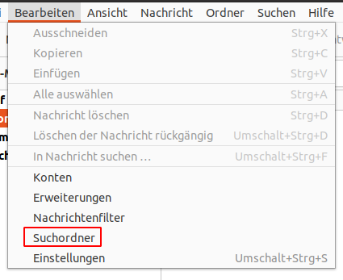
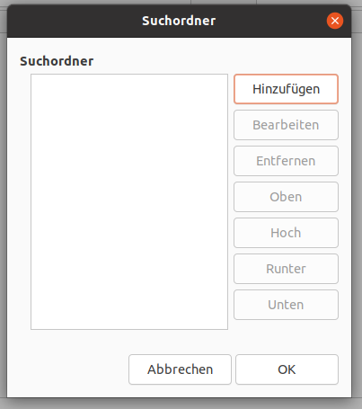

Geben Sie dem Suchordner einen Namen, z.B. "Unified-Inbox". Legen Sie Folgendes fest:

  * Objekte suchen, die entsprechen: _eine der folgenden Bedingungen_.
  * Konversationen einschließen: _keine_.
  * _Status_ _ist_ _Gelesen_
  * _Status_ _ist nicht_ _Gelesen_ (den zweiten Eintrag bekommen Sie duch Klick auf "Bedingung hinzufügen")
  * Häkchen bei _Bei jeder Änderung des Quellordners automatisch aktualisieren_
  * _Bestimmte Ordner_

Klicken Sie auf Hinzufügen, um die Postfächer auszuwählen.

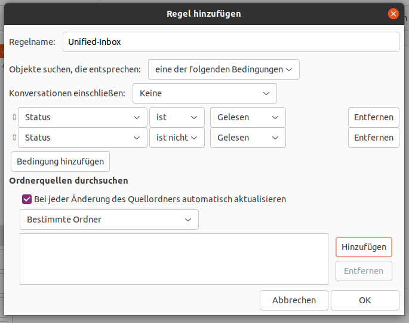

Es öffnen sich ein Dialog zur Auswahl der Ordner, die in die Unified-Inbox einbezogen werden sollen. Wählen Sie hier den Posteingang (_Inbox_) des ersten Accounts aus und klicken Sie auf "Hinzufügen".

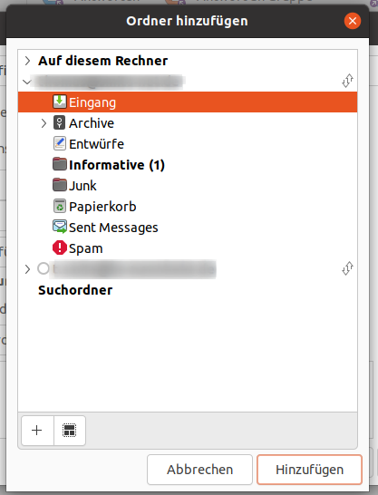
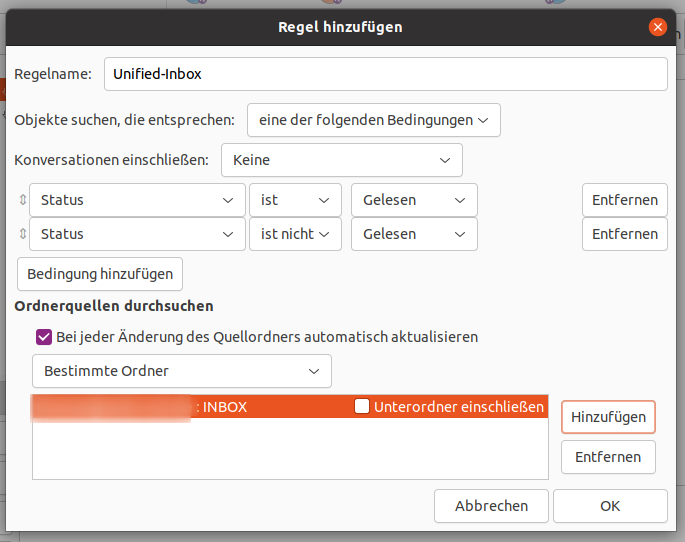


Fügen Sie nach demselben Schema die weiteren Postfächer hinzu.

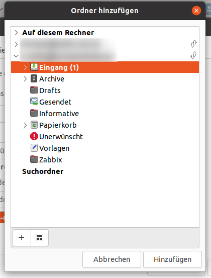

Wenn Sie alle Postfächer erfasst haben, klicken Sie auf "OK" und im Dialog für Suchordner noch einmal auf "OK".

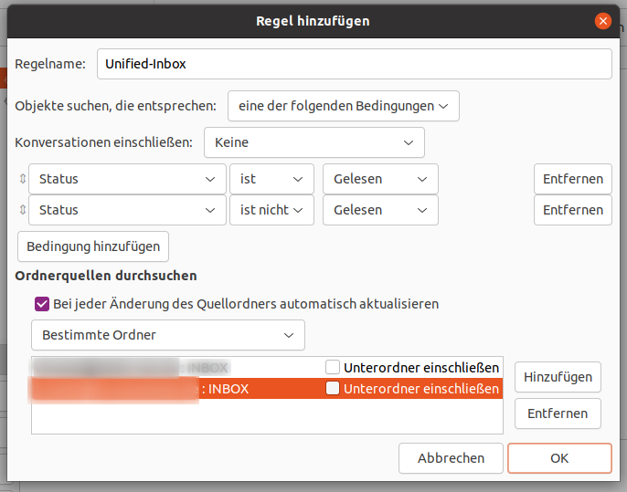
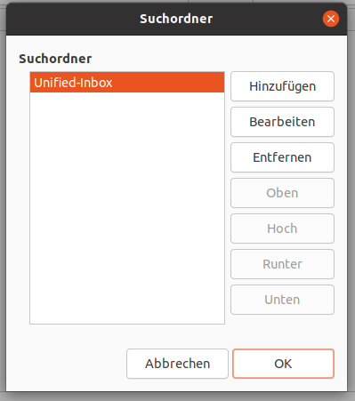

Links in der Ordnerliste von Evolution taucht jetzt der Eintrag Suchordner auf und Sie finden darin die Unified-Inbox mit den Mails aus allen Posteingängen gemeinsam.

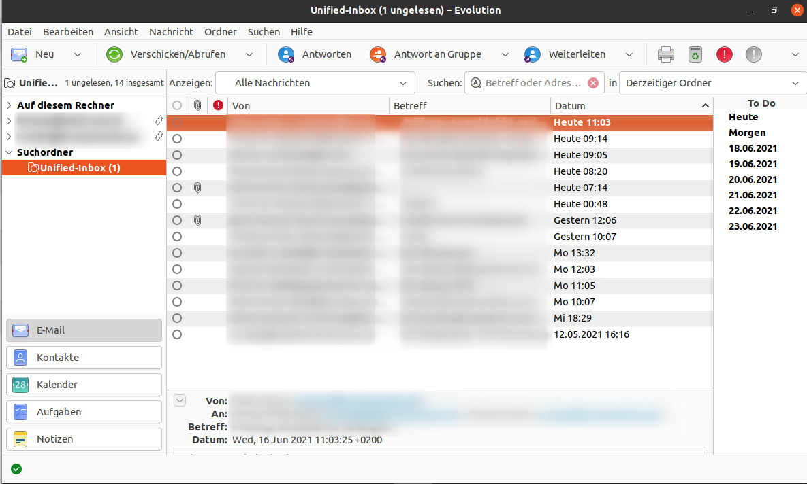

Falls es Sie stört, dass die Unified-Inbox am Ende der Accounts angezeigt wird, gehen Sie auf "Bearbeiten", "Einstellungen".

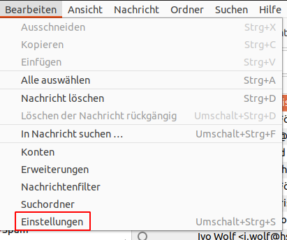

Und schieben Sie in der Liste der E-Mail Konten die Suchordner einfach mit der Maus an den Anfang der Liste.

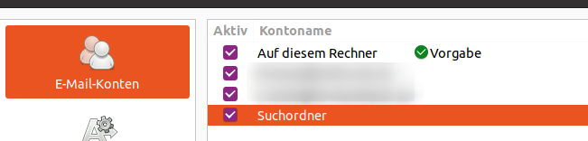
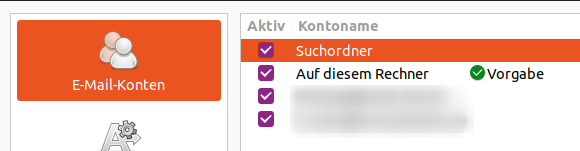

Die Suchordner sind jetzt am Anfang der Accounts zu finden.

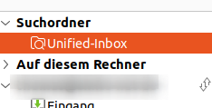

## Kalender einrichten

Wählen Sie in Evolution "Bearbeiten" -> "Konten" und klicken Sie auf Hinzufügen.


Wählen Sie als "Art" des Kalenders "CalDav".

Legen Sie einen neuen Kalender mit folgenden Eigenschaften an:

  * Adresse: `https://mail.hs-mannheim.de/CalDAV/Kalender/`
  * Benutzername: Ihre Matrikelnummer oder zentrale Kennung
  * E-Mail: Ihre E-Mail-Adresse


Nach dem Drücken auf OK vergehen ein paar Sekunden und Evolution fragt nach dem Passwort für den Account.


## Adressbuch einrichten

TBD

`https://mail.hs-mannheim.de/CardDAV/$Contacts$/`

[Zurück](readme.md)