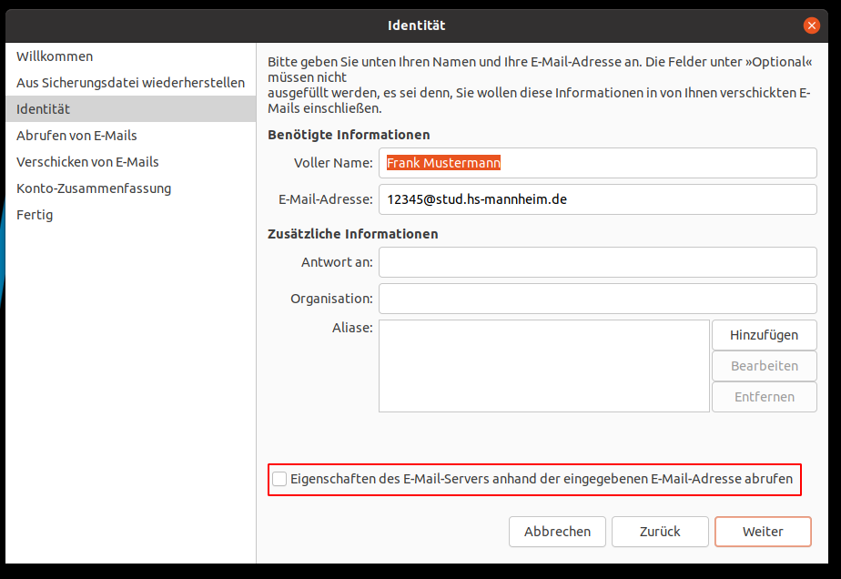
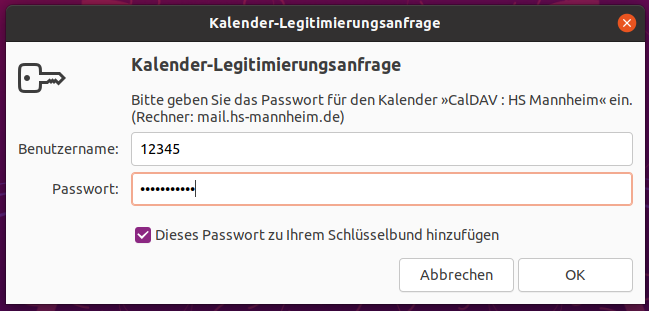

# Evolution

Ein sehr leistungsfähiges Groupware-Programm unter Ubuntu heißt _Evolution_. Es ist bezüglich der Funktionalität in etwa mit Microsoft Outlook vergleichbar.

Starten Sie Evolution. Sollte es noch nicht [installiert](installation-packages.md) sein, können Sie es im Terminal mit dem folgenden Befehl installieren:

```console
sudo apt install -y evolution
```

## E-Mail einrichten

Beim ersten Start zeigt Evolution den Einrichtungsassistenten an. Klicken Sie auf "weiter".


Da Sie keine Sicherungsdatei besitzen, können Sie den nächsten Dialog einfach mit "weiter bestätigen".


Tragen Sie Ihren vollständigen Namen und Ihre E-Mail-Adresse ein und **entfernen** Sie den Haken "Eigenschaften des E-Mail-Servers anhand der eingegebenen E-Mail-Adresse abrufen". Klicken Sie "weiter".



Tragen Sie die Zugangsdaten für den Mailserver der Hochschule ein.

  * Server: `stud.hs-mannheim.de` für Studierende und `mail.hs-mannheim.de` für Mitarbeiter.
  * Port: `993`
  * Benutzername: Ihre Matrikelnummer (für Studierende) oder Ihr zentraler Benutzername (für Mitarbeiter).

Klicken Sie auf "weiter".


Konfigurieren Sie die Abrufeinstellungen für die E-Mails und gehen Sie auf "weiter".


Für das Versenden der E-Mails geben Sie folgende Daten ein:

  * Server: `stud.hs-mannheim.de` für Studierende und `mail.hs-mannheim.de` für Mitarbeiter.
  * Port: `465`
  * Server erfordert Legitimation: Häkchen setzen
  * Benutzername: Ihre Matrikelnummer (für Studierende) oder Ihr zentraler Benutzername (für Mitarbeiter).


Überprüfen Sie die Zusammenfassung und bestätigen Sie mit "weiter".


Ihre E-Mail sollte eingerichtet sein und Sie können den Assistenten mit "Anwenden" beenden.


## Kalender einrichten

Wählen Sie in Evolution "Bearbeiten" -> "Konten" und klicken Sie auf Hinzufügen.


Wählen Sie als "Art" des Kalenders "CalDav".

Legen Sie einen neuen Kalender mit folgenden Eigenschaften an:

  * Adresse: `https://mail.hs-mannheim.de/CalDAV/Kalender/`
  * Benutzername: Ihre Matrikelnummer oder zentrale Kennung
  * E-Mail: Ihre E-Mail-Adresse


Nach dem Drücken auf OK vergehen ein paar Sekunden und Evolution fragt nach dem Passwort für den Account.



## Adressbuch einrichten

TBD

`https://mail.hs-mannheim.de/CardDAV/$Contacts$/`

[Zurück](readme.md)