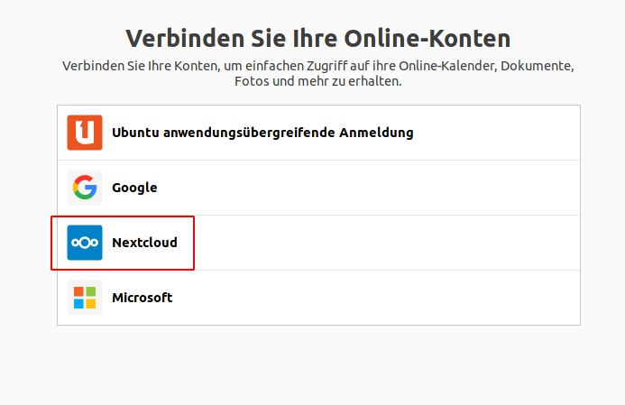
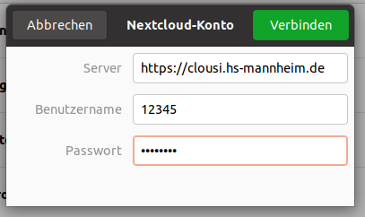
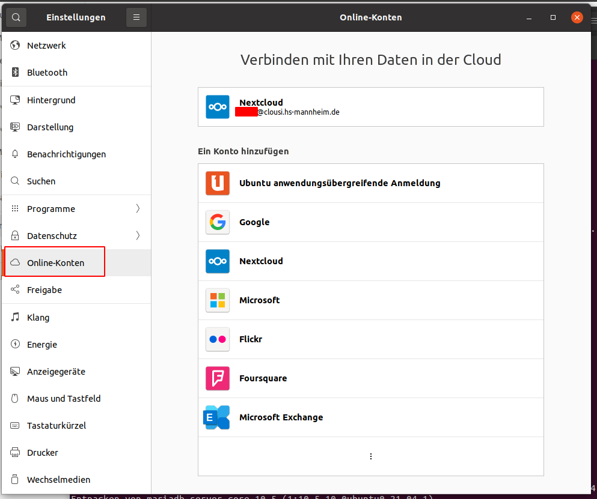
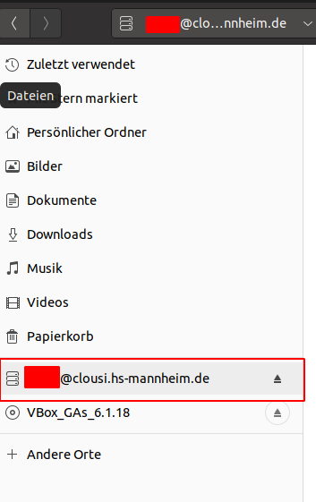

## NextCloud verbinden

Sie können Ihre Ubuntu-Installation direkt mit dem NextCloud-Angebot (_Clousi_) der Hochschule verbinden. Direkt nach der Installation wird Ihnen ein Dialog angezeigt, mit dem Sie Ihre Cloud-Konten verbinden können.

Geben Sie als Server `https://clousi.hs-mannheim.de` an und Ihre Matrikelnummer bzw. Ihren zentralen Benutzernamen. Das Passwort ist ebenfalls Ihr zentrales Kennwort.

Sie können jederzeit weitere Konten hinzufügen, indem Sie in den Einstellungen auf den Eintrag "Online-Konten" gehen.

Die Dateien in der Cloud werden Ihnen im File-Manager angezeigt.

[Zurück](readme.md)
