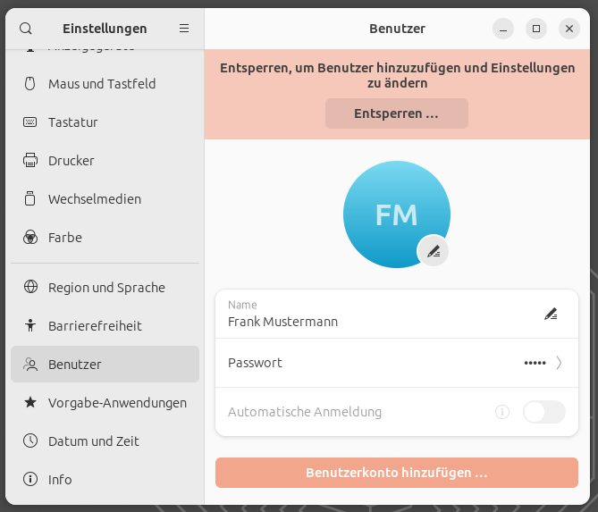
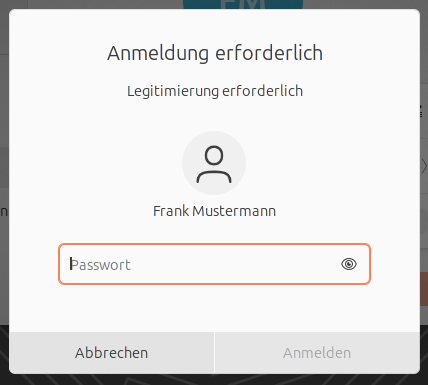
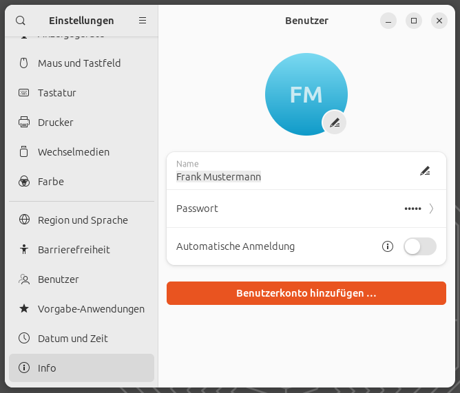
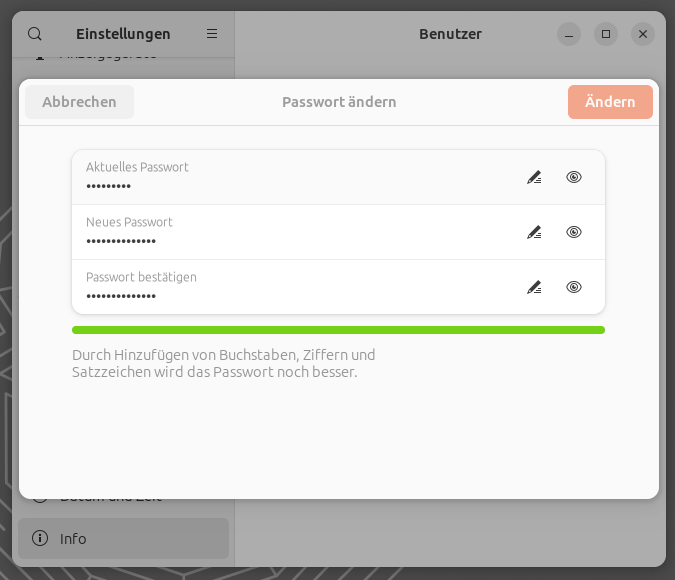

# Password neu setzen

Drücken Sie die Windows Taste oder klicken Sie auf die Schaltfläche mit den neun Punkten, um die Suche zu öffnen und suchen Sie nach "Einstellungen".

Wählen Sie in der linken Leiste den Menüpunkt "Benutzer aus" und entsperren Sie die Nutzerverwaltung mit Ihrem Passwort.

Klicken Sie auf Passwort.

Geben Sie Ihr altes Passwort und das neue Passwort ein (inklusive Widerholung) und klicken Sie auf "Ändern".

[Zurück](readme.md)
