# Password-Manager KeepassXC

Die Verwendung eines Passwort-Managers ist ausgesprochen sinnvoll. Ein solches Werkzeug erlaubt es, die Passwörter für verschiedene Accounts und Webseiten zentral und sicher aufzubewahren. Da man sich nur noch ein Master-Passwort merken muss, kann man wirklich sichere, zufällige Passwörter einsetzen.

Diese Anleitung geht davon aus, dass Sie bereits die [Installation der empfohlenen Pakete](installation-packages.md) durchgeführt haben. Falls nicht, müssen Sie folgendes Kommando im Terminal eingeben:

```console
$ sudo snap install keepassxc
```

## Datenbank anlegen

Damit Ihre Passwörter gespeichert werden können, benötigen Sie in KeepassXC eine Datenbank. Diese legen Sie wie folgt an.

Starten Sie KeepassXC und wählen Sie "Neue Datenbank anlegen".

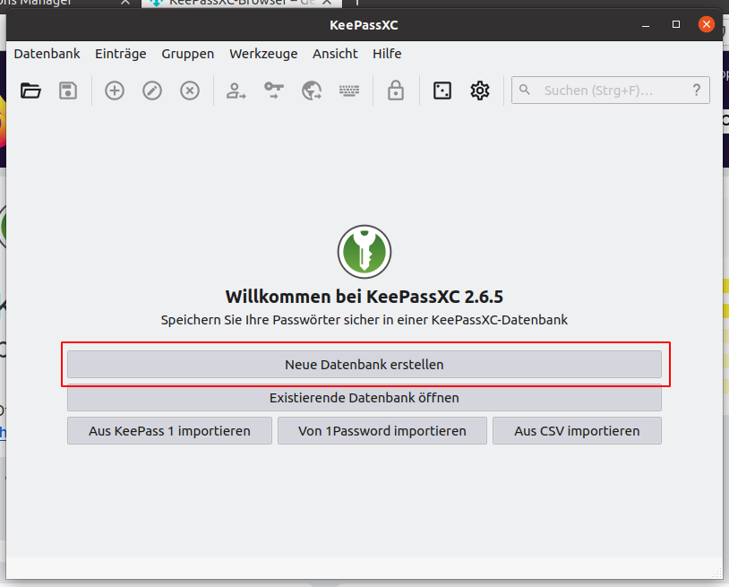

Geben Sie der Datenbank einen sinnvollen Namen. Sie können mehrere Datenbanken haben und die Namen helfen bei der Unterscheidung.

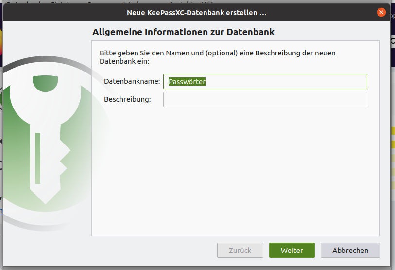

Legen Sie die Sicherheitsstufe fest und das Datenbankformat. Die Standardeinstellungen sind gut und müssen nicht angepasst werden.

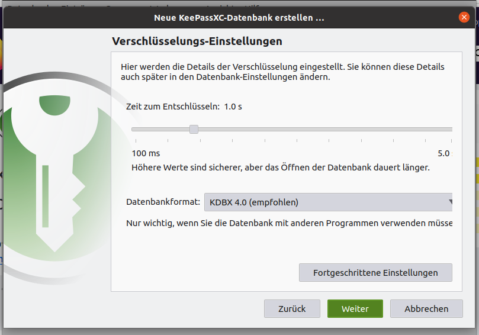

Setzen Sie das Passwort für die Datenbank. Verwenden Sie am besten eine lange Passphrase mit Worten anstatt eines einzelnen Passwortes. Die Passphrase sollte dann aber keinen sinnvollen Satz ergeben.

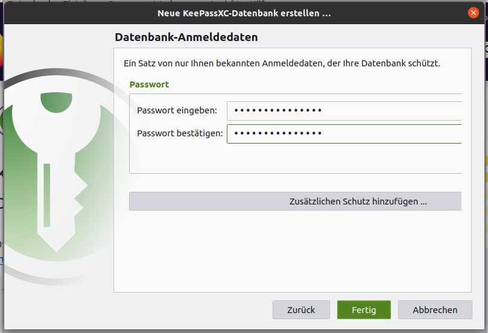

Nach Drücken auf "Fertig" ist die Datenbank angelegt und kann benutzt werden, um Passwörter sicher zu speichern.

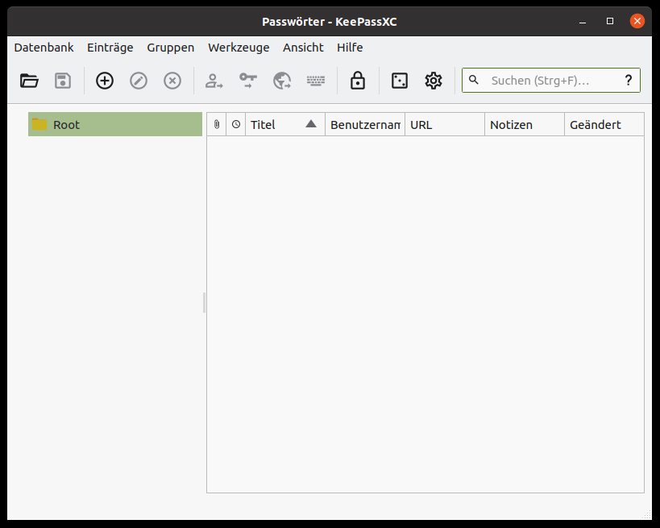

## Browser Integration ermöglichen

Wichtig ist die Integration des Passwort-Managers in den oder die Browser. Da KeepassXC als Snap installiert worden ist, müssen Sie noch ein kleines Hilfsscript verwenden. Die Installation als Snap hat den Vorteil, dass Sie immer die aktuelle Version verwenden.

Das Skript können Sie einfach von GitHub mit dem folgenden Kommando herunterladen.

```console
$ wget https://raw.githubusercontent.com/keepassxreboot/keepassxc/master/utils/keepassxc-snap-helper.sh
...
Saving to: 'keepassxc-snap-helper.sh'
keepassxc-snap-helper.sh 100%[=================================>]   3,97K  --.-KB/s    in 0s
2021-06-10 15:31:19 (76,7 MB/s) - 'keepassxc-snap-helper.sh' saved [4068/4068]
```

Führen Sie danach das Skript aus.

```console
$ bash keepassxc-snap-helper.sh
```

Nach dem Starten fragt das Script einige Informationen zum Browser ab. Wählen Sie den Browser aus, für den Sie die Integration einrichten wollen. Hier im Beispiel _Firefox_.

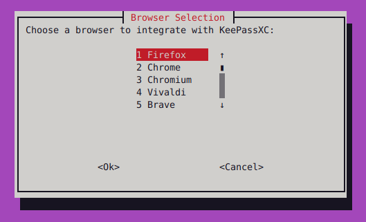

Legen Sie fest, ob der Browser selbst als Snap installiert wurde. Bei Firefox ist die Antwort "Nein". Bei den anderen Browsern hängt es davon ab, wie sie installiert wurden.

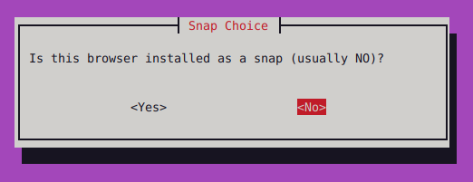

Bestätigen Sie den letzten Dialog mit Ok und starten Sie den Browser gegebenenfalls neu.

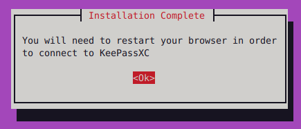

## Browser-Zugriff in KeepassXC einschalten

Starten Sie KeepassXC und wählen Sie die Einstellungen.

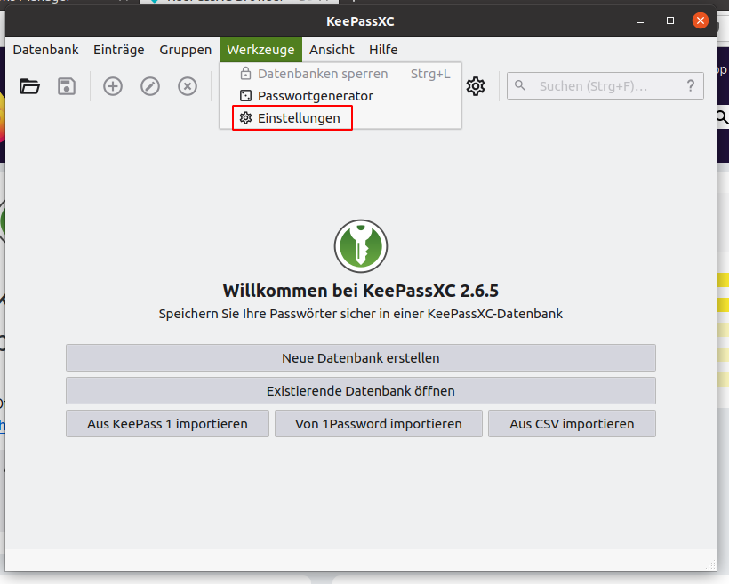

Wählen Sie Links "Browser Integration" und setzen Sie den Haken bei "Browserintegration aktivieren".

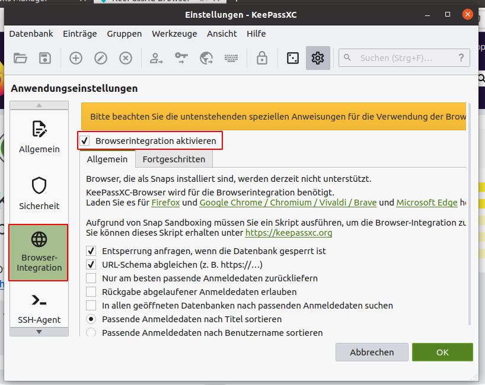

Bestätigen Sie mit "OK".

## Integration in Firefox einrichten

Nachdem Sie die Browserintegration generell freigeschaltet haben, müssen Sie noch ein Plugin im Browser installieren und dieses mit der Datenbank verbinden.

Öffnen Sie in Firefox den Menüpunkt "Erweiterungen" oder drücken Sie `Ctrl+Shift+A`. Geben Sie in das Suchfeld "keepassxc" ein drücken Sie "Enter".

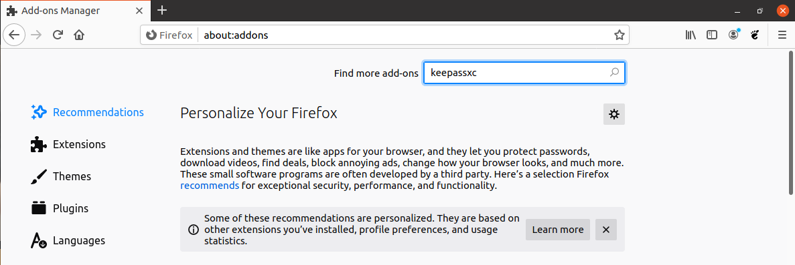

Wählen Sie aus der Liste die Erweiterung "KeepassXC-Browser" aus.

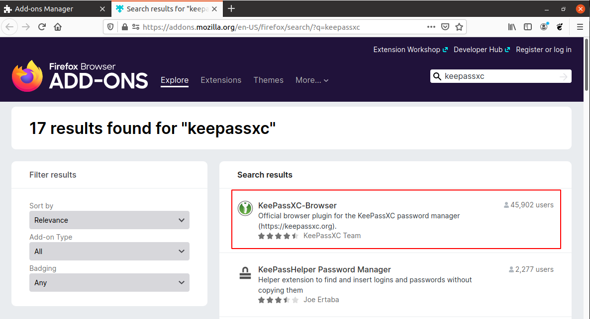

Klicken Sie auf "Add to Firefox".

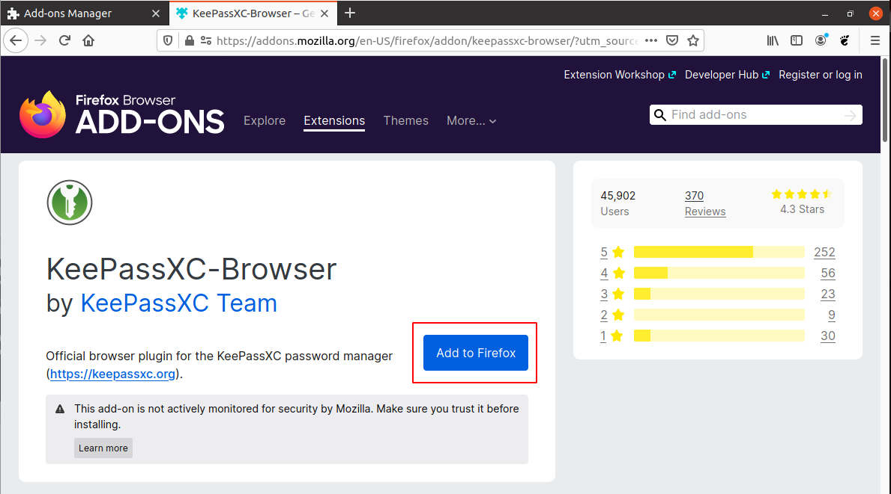

Bestätigen Sie die Abfragen.

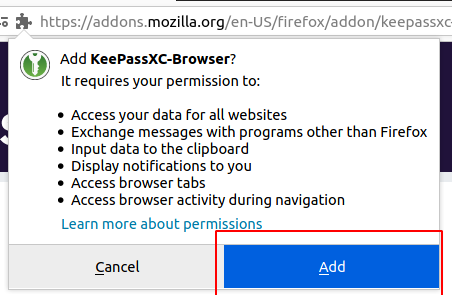
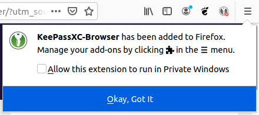

Nachdem die Erweiterung installiert wurde, erscheint rechts oben in der Ecke von KeepassXC. Klicken Sie darauf.

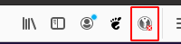

Im Dialog klicken Sie auf "Connect"...

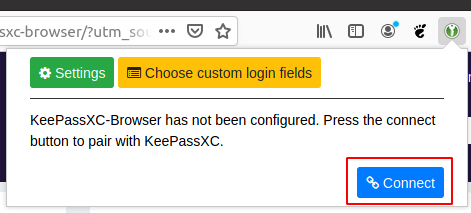

... und geben Der Verbindung zur Datenbank einen Namen, z.B. "Firefox".

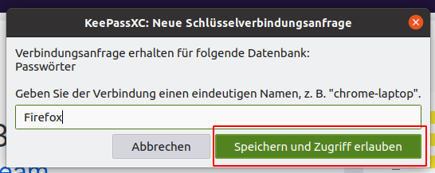

Nach Klicken auf "Speichern und Zugriff erlauben", hat Firefox Zugriff auf die Passworte in der Datenbank. Sie erkennen das daran, dass das KeepassXC-Logo sich grün verfärbt. 

Sollte das Logo hingegen ein rotes X tragen , dann zeigt das an, dass KeepassXC noch nicht gestartet wurde. Ein gelbes Schloss  zeigt an, dass die KeepassXC zwar läuft, aber die Datenbank noch nicht entsperrt wurde oder sich selbst gesperrt hat -- z.B. weil der Bildschirm gelockt war. Es kann auch bedeuten, dass der Browser _vor_ dem Öffnen der Datenbank gestartet wurde. In beiden Fällen entsperren Sie die Datenbank, öffnen die Browser-Extension durch Klicken auf das Logo und gehen Sie dann auf "Reload".
