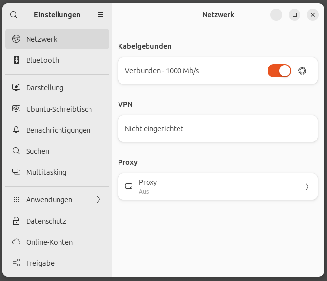
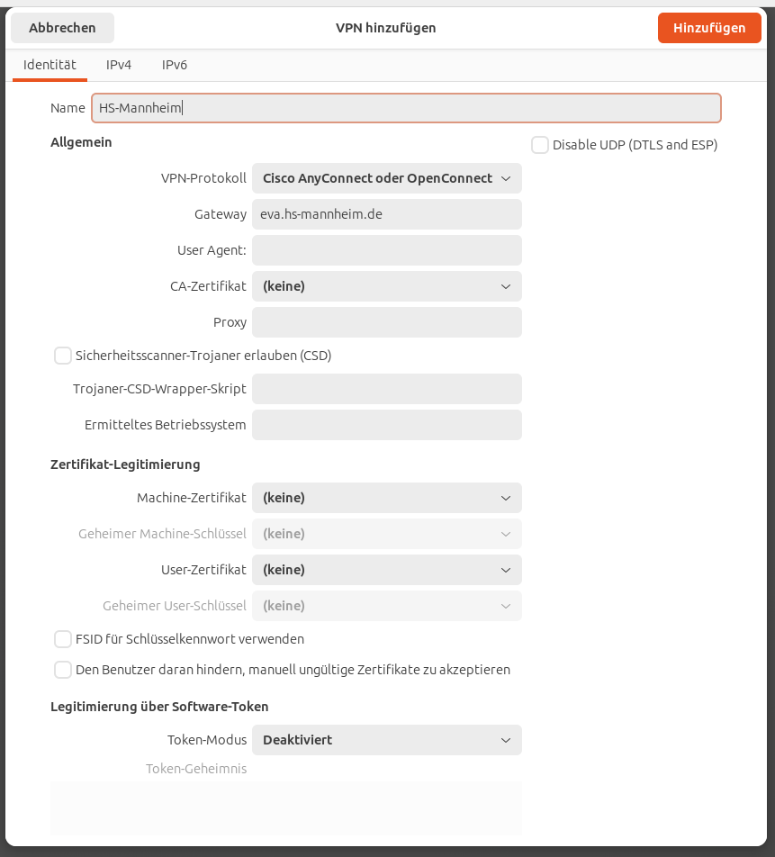
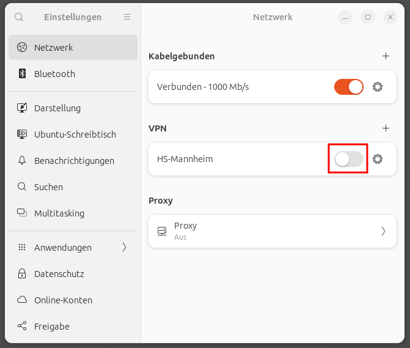

## VPN Einrichten

Diese Anleitung geht davon aus, dass Sie bereits die [Installation der empfohlenen Pakete](installation-packages.md) durchgeführt haben. Falls nicht, müssen Sie folgendes Kommando im Terminal eingeben:

```console
$ sudo apt install -y openconnect network-manager-openconnect network-manager-openconnect-gnome
```

Öffnen Sie die Einstellungen und wählen Sie den Punkt "Netzwerk" aus und klicken Sie beim Punkt "VPN" auf das "+"-Zeichen.



Wählen Sie als Typ des VPNs Multiprotokoll-VPN-Client aus.


Geben Sie dem VPN einen Namen, z.B. "HS-Mannheim" und wählen Sie als VPN-Protokoll "Cisco AnyConnect oder Openconnect" aus. Für das Gateway tragen Sie `eva.hs-mannheim.de` ein. Alle weiteren Optionen lassen Sie einfach auf den Standardwerten stehen. Klicken Sie auf "Hinzufügen", um die VPN-Konfiguration zu speichern.



Zum Test können Sie jetzt das VPN durch einen Klick auf den Schiebeschalter starten.



Es öffnet sich der Login-Dialog in den Sie Ihren Benutzernamen (Matrikelnummer@hs-mannheim.de bzw. ZentraleKennung@hs-mannheim.de) und Ihr zentrales Kennwort eintragen.


Durch Klicken auf Login sollte die Verbindung aufgebaut werden.

[Zurück](readme.md)
