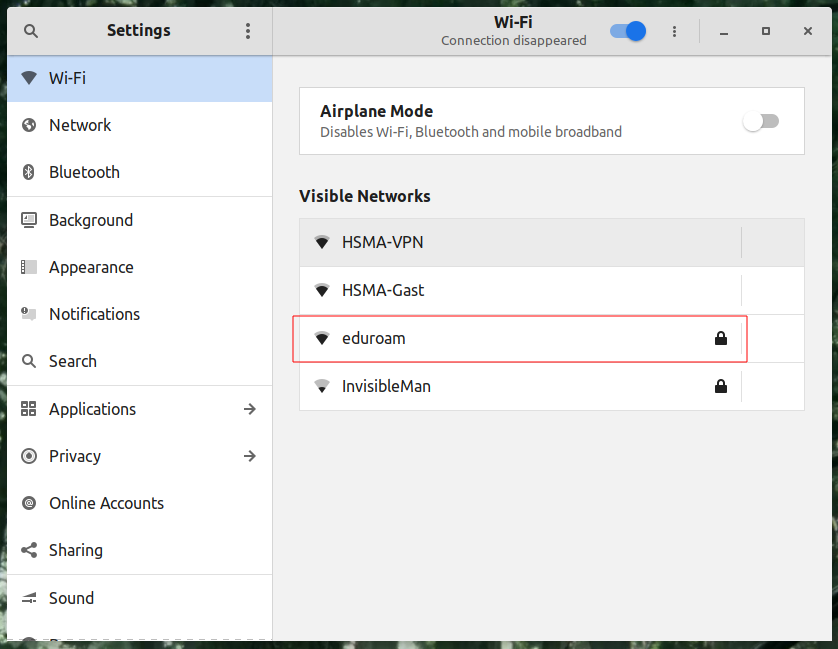
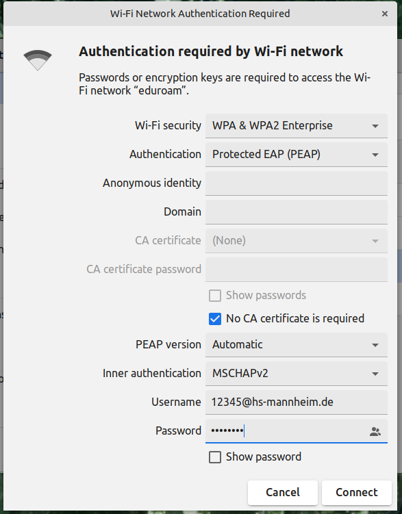

## WLAN Einrichten

Innerhalb der Hochschule müssen Sie kein VPN verwenden, sondern können sich direkt mit dem WLAN verbinden.

Öffnen Sie die Einstellungen und wählen Sie den Punkt "WIFI/WLAN" aus. Dort sollten Ihnen verschiedene WLANs angezeigt werden. Wählen Sie das Netzwerk "eduroam" aus.

Konfigurieren Sie das Netzwerk entsprechend dem folgenden Screenshot:

Studierende müssen nach ihrer Matrikelnummer `@hs-mannheim.de` angeben. Mitarbeitende verwenden ihren zentralen Nutzernamen (**nicht E-Mail-Adresse**) plus `@hs-mannheim.de`. Das Passwort ist das zentrale Passwort.

Durch Klicken auf _Verbinden_ (_Connect_) sollte die Verbindung aufgebaut werden.

[Zurück](readme.md)