# Installation von EndeavourOS

## USB-Stick erstellen und booten

  1. Laden Sie sich EndeavourOS von der Webseite [herunter](https://endeavouros.com/).
  2. Verwenden Sie [Balena Etcher](https://www.balena.io/etcher/), um einen bootfähigen USB-Stick zu erstellen. Eine Anleitung finden Sie [hier](https://ubuntu.com/tutorials/create-a-usb-stick-on-windows#1-overview)
  3. Booten Sie den USB-Stick. Möglicherweise müssen Sie im BIOS erst das Booten von einem USB-Stick aktivieren oder den Stick in der Boot-Reihenfolge nach oben verschieben.

Wenn Sie den Stick erfolgreich gebootet haben, erscheint GRUB, der Boot-Manager von Linux.

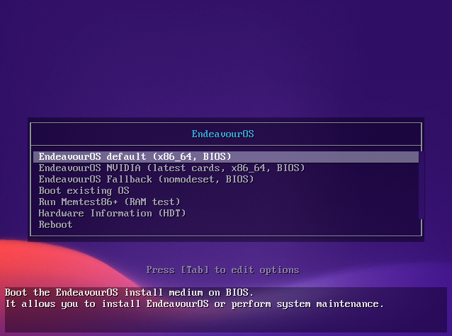

Drücken Sie einfach "ENTER".

## Installation durchführen

### Installation starten

Nach dem Start des Betriebssystems erscheint nach ein paar Sekunden ein Dialog, in dem Sie "Start the Installer" auswählen müssen.

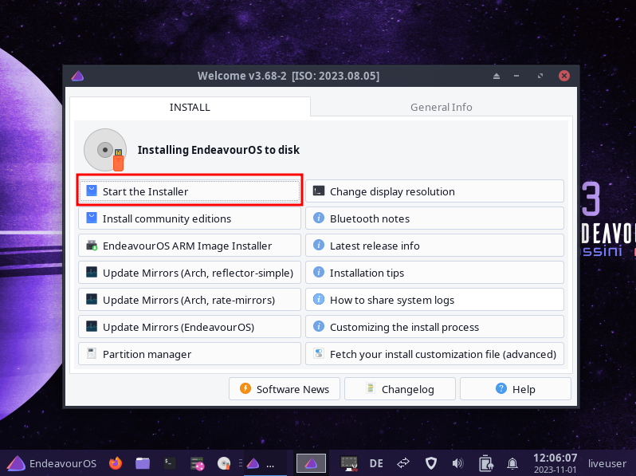

### Installationsmethode

Vom Boot-Medium kann EndeavourOS nur XFCE als Desktop-Umgebung installieren. Wir möchten aber das deutlich mächtigere Gnome auswählen. Deswegen müssen wir eine Online-Installation durchführen.

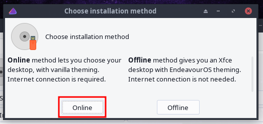

### Sprache auswählen

Wählen Sie die Sprache für die Installation (und das spätere System) aus.

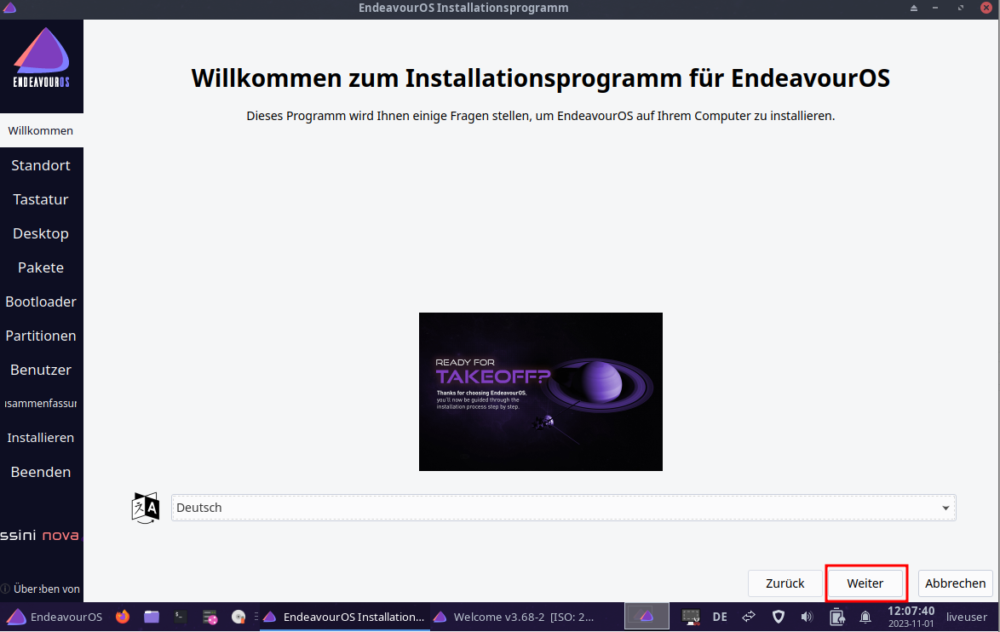

### Zeitzone auswählen

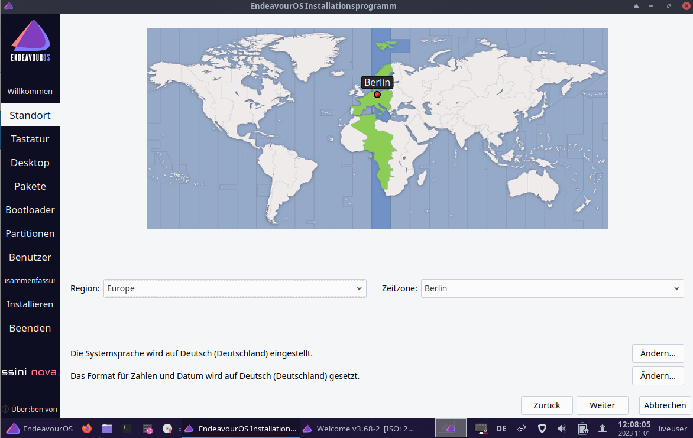

### Tastatur-Layout wählen

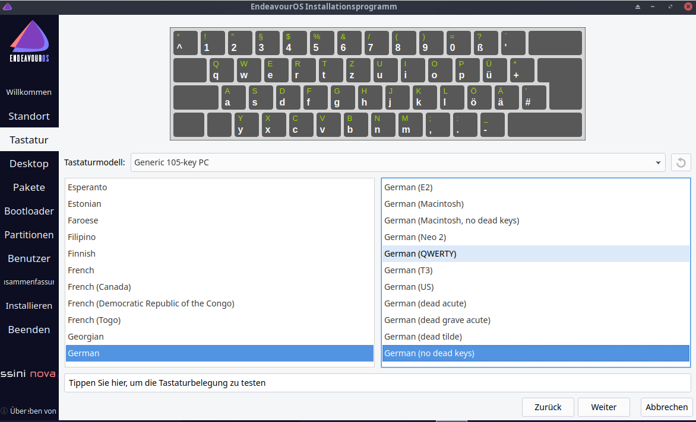

### Desktop-Umgebung

EndeavourOS unterstützt eine Reihe von Desktop-Umgebungen. Wir verwenden hier Gnome.

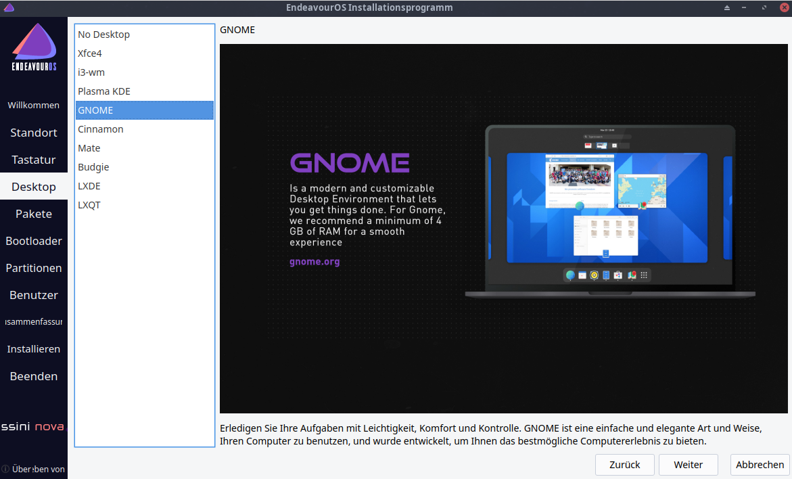

### Umfang der Installation

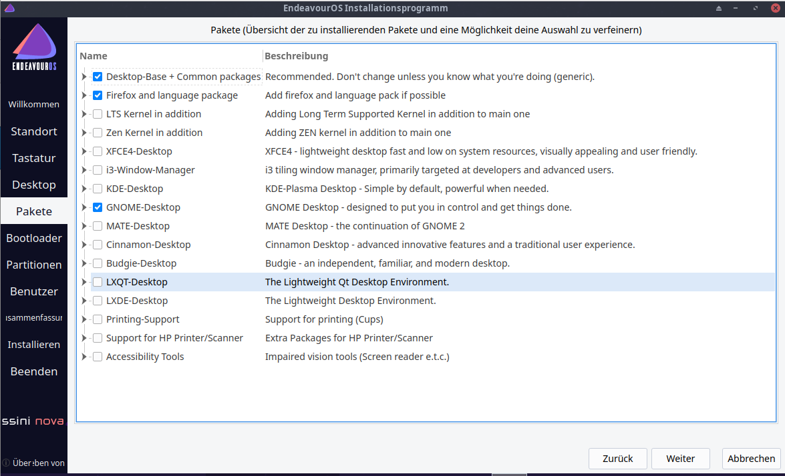

Hier können Sie es bei den Voreinstellungen belassen, weil wir die weitere Software in einem späteren Schritt installieren werden.

### Bootmanager

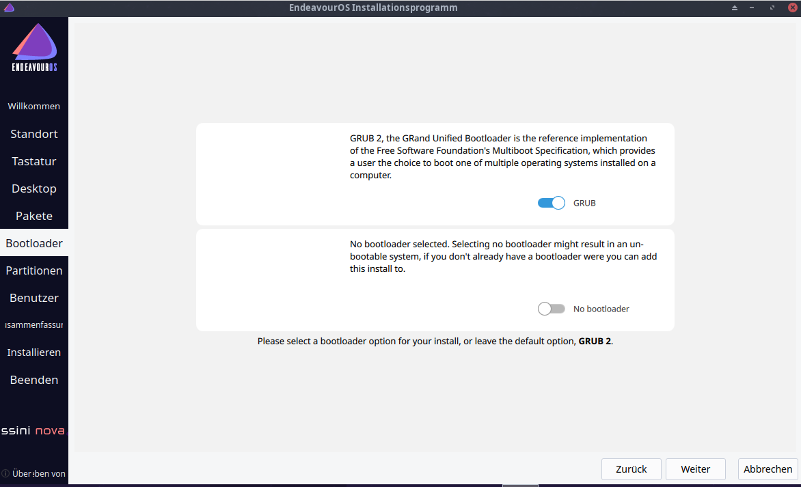

### Installationsart

Wenn Sie den Computer vollständig Linux widmen wollen oder eine virtuelle Maschine installieren, ist die erste Option die Richtige. Falls Sie mehrere Betriebssysteme parallel installieren wollen, müssen Sie die zweite Option auswählen und die Festplatte partitionieren.

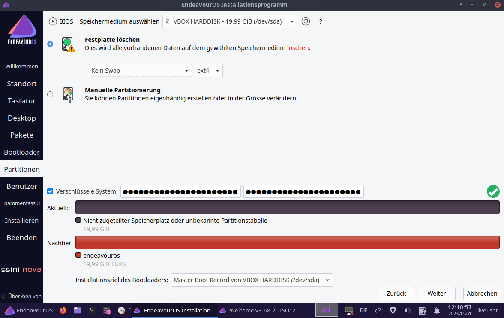

#### Vollverschlüsselung der Festplatte

Generell bietet es sich an, die Festplatte voll zu verschlüsseln. So sind Ihre Daten sowohl bei Verlust des Computers als auch bei Zugriff durch Strafverfolgungsbehörden oder Kriminelle (oder beides) geschützt. Wählen Sie hierzu das Häkchen an. Wollen Sie keine Verschlüsselung, so gehen Sie direkt auf "Weiter".

Haben Sie eine Verschlüsselung gewählt, müssen Sie noch ein Passwort als _Sicherheitsschlüssel_ festlegen. Wählen Sie hier eine lange und möglichst sichere Passphrase, die Sie sich gut merken können. Diese müssen Sie bei jedem Neustart des Systems eingeben.

### Benutzername und Passwort

Legen Sie Ihren Benutzernamen, Ihr Passwort und den Namen des Computers fest. Wählen Sie ein sicheres Passwort -- "mutti123" ist kein sicheres Passwort.

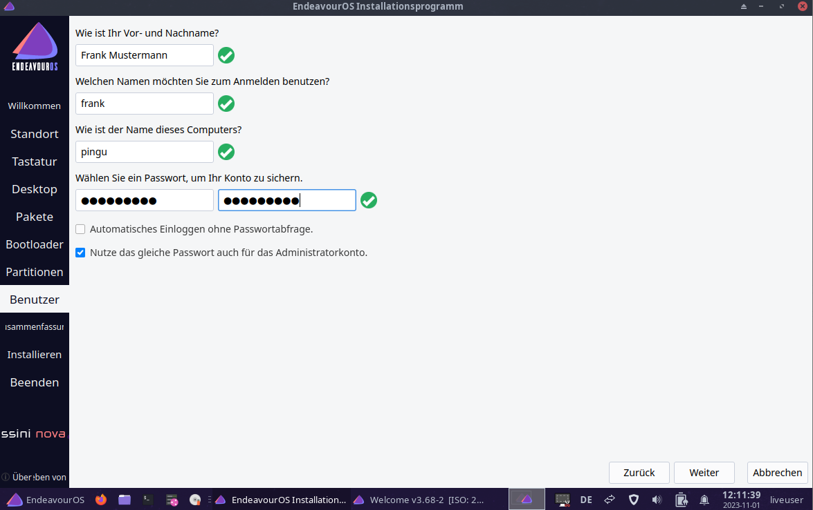

> Es kann passieren, dass bei der Passwort-Eingabe die Tastatureinstellungen nicht beachtet werden. In diesem Fall wird eine amerikanische Tastatur benutzt und "y" und "z" sind vertauscht.

### Bereit zur Installation

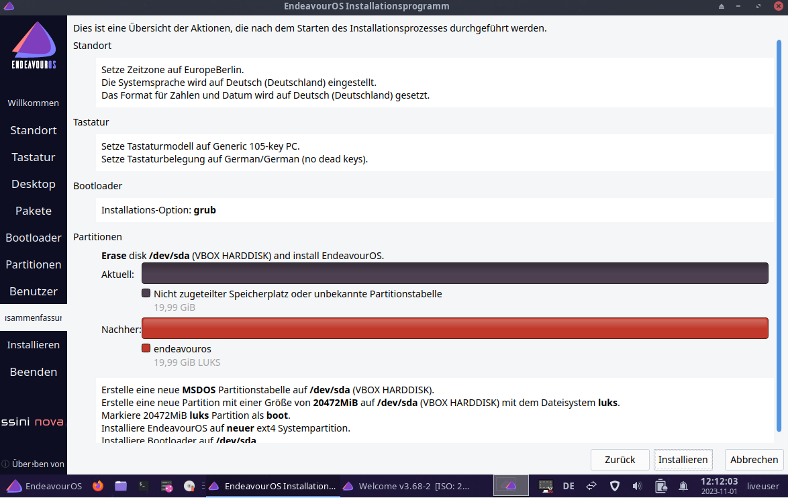

Sie werden noch einmal gewarnt, dass die ausgewählte Festplattenpartition überschrieben wird.

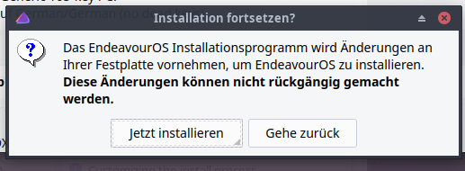

### Installation durchführen

Warten Sie, bis die Installation durchgelaufen ist.

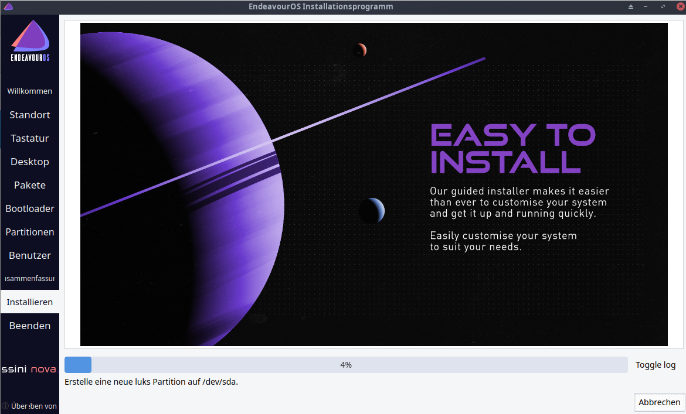

### Neustart

Nach Abschluss der Installation drücken Sie auf "Jetzt neu starten".

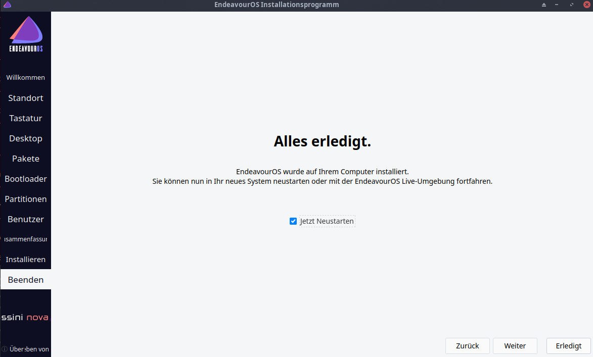

## Erstmalige Anmeldung

### Festplatten-Kennwort

Wenn Sie die Festplatte verschlüsselt haben, müssen Sie bei jedem Neustart das Festplatten-Passwort eingeben.

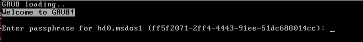

Danach kommt das eigentliche Boot-Menue, das Sie einfach mit ENTER bestätigen können.

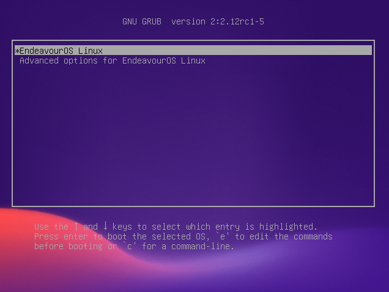

Melden Sie sich mit Ihrem Benutzernamen und Kennwort an.

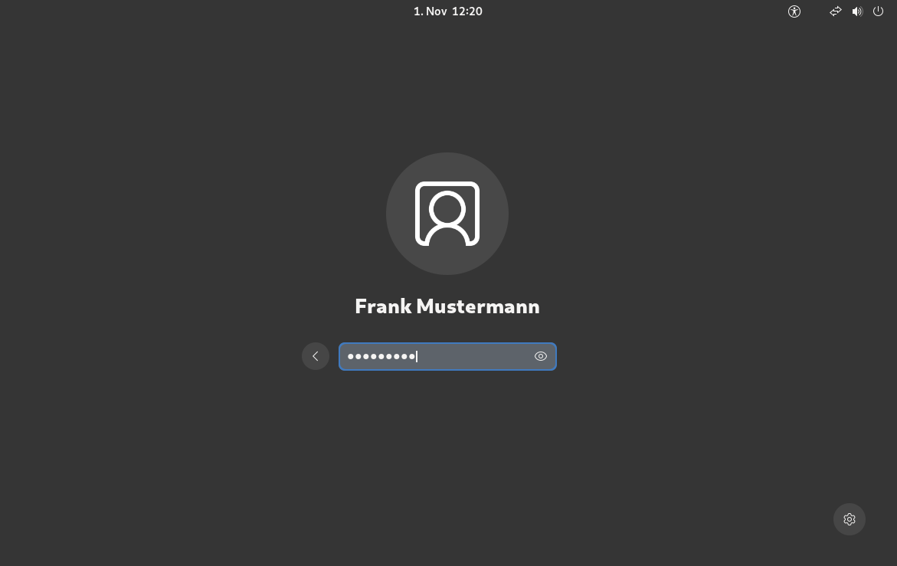

Falls Ihr Passwort nicht funktioniert, könnte der bei der Passwort-Eingabe weiter oben beschriebene Fehler zugeschlagen haben. Versuchen Sie die Buchstaben "y" und "z" zu vertauschen. Sollten Sie dieses Problem haben, setzen Sie Ihr [Passwort neu](setup-password.md).

### Updates

Sie können jetzt noch einmal Updates installieren.

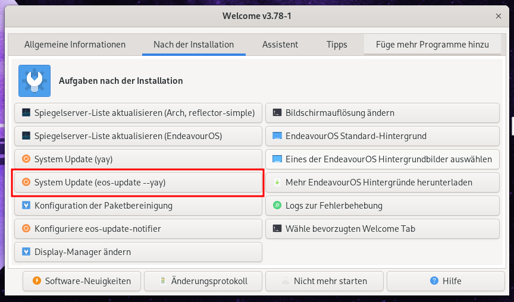
