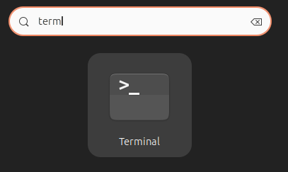

# Spezifische Pakete installieren

Für die Arbeit an der Hochschule und Ihr Studium benötigen Sie -- natürlich abhängig von den besuchten Vorlesungen und Aufgaben -- eine Reihe von Software-Paketen. Um die Auswahl möglichst einfach zu machen, können Sie sich automatisch eine Reihe von Paketen installieren lassen, die Ihr System so konfigurieren, dass es sich gut für ein Studium an der Fakultät für Informatik an der Technischen Hochschule Mannheim eignet.

## Installationsskripte herunterladen

Die meisten Anpassungen am System für die Arbeit an der Hochschule können automatisch durch eine Reihe von Skripten erfolgen. Diese müssen Sie einmalig herunterladen und das Installationsprogramm starten. Die Skripte installieren zusätzliche Programme und nehme einige Konfigurationen vor.

Als Erstes müssen Sie `git` installieren, hierzu öffnen Sie ein Terminal.



Geben Sie folgendes Kommando ein (das `$` ist nicht Teil des Kommandos, sondern das Prompt der Shell):

```console
$ sudo pacman -S git
```

Sie werden nach Ihrem Passwort gefragt. Geben Sie dieses an.

Wenn die Installation abgeschlossen ist, clonen Sie das Repository mit den Installationswerkzeugen mit folgendem Kommando:

```console
$ git clone https://github.com/informatik-mannheim/linux-hsma.git
```

Sie sollten eine Ausgabe, ähnlich zu der folgenden, sehen:

```console
remote: Enumerating objects: 14, done.
remote: Counting objects: 100% (14/14), done.
remote: Compressing objects: 100% (11/11), done.
remote: Total 14 (delta 2), reused 14 (delta 2), pack-reused 0
Receiving objects: 100% (14/14), 38.82 KiB | 4.85 MiB/s, done.
Resolving deltas: 100% (2/2), done.
```

## Installation der Pakete starten

Gehen Sie in das gerade erzeugte Verzeichnis `linux-hsma`.

```console
$ cd linux-hsma/endeavour
```

Bevor Sie die Installation starten, können Sie noch Anpassungen an den zu installierenden Paketen vornehmen. Sie finden die Konfigurationen in dem Verzeichnis `lst`. Sie können entweder ganze Dateien löschen oder innerhalb der Dateien einzelne Programme und Pakete auskommentieren.

Insbesondere die Installation von LaTeX und den Entwicklungswerkzeugen von JetBrains verbraucht relativ viel Speicherplatz auf dem Rechner. Wenn Sie diese nicht wünschen, dann löschen Sie die entsprechenden Dateien:

  * `lst/pacman-tex.lst`
  * `lst/yay-development.lst`

Wenn Sie damit fertig sind, starten Sie die Installation.

```console
$ sudo ./bootstrap.sh
```

Beim Start werden Sie wahrscheinlich nach Ihrem Passwort gefragt, da das Skript mit Administratorrechten laufen muss.

Es wird eine umfangreiche Sammlung von Software-Paketen installiert, sodass der Vorgang einige Zeit dauern kann.

Das Skript ist so gestaltet, dass Sie es bei einem Abbruch einfach neu starten können.

Während der Installation fragt Sie das Skript teilweise, welche Version eines Programms Sie installieren wollen:

```console
2 aur/intellij-idea-ultimate-edition-jre 2023.2.4-1 (+407 1.72)
    An intelligent IDE for Java, Groovy and other programming languages with advanced refactoring features intensely focused on developer productivity.
1 aur/intellij-idea-ultimate-edition 2023.2.4-1 (+407 1.72) (Installed)
    An intelligent IDE for Java, Groovy and other programming languages with advanced refactoring features intensely focused on developer productivity.
==> Packages to install (eg: 1 2 3, 1-3 or ^4)
==>
```

Antworten Sie hier immer mit `1`.

### MariaDB

Wenn die Datenbank MariaDB installiert wurde, müssen Sie das Passwort für den Benutzer `admin` angeben.

```console
-------------------------------------------------------
Setup der Datenbank MariaDB
-------------------------------------------------------
Passwort für Benutzer admin in der Datenbank: mutti123
```

### Git

Für Git müssen der Name und die E-Mail-Adresse angegeben werden, die in den Commit-Messages auftauchen.

```console
-------------------------------------------------------
Setup des git clients
-------------------------------------------------------
Ihr vollständiger Name : Frank Mustermann
Ihre E-Mail-Adresse    : 12345@stud.hs-mannheim.de
```

[Zurück](readme.md)
