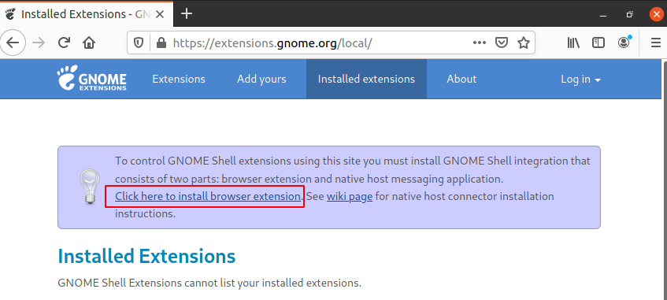
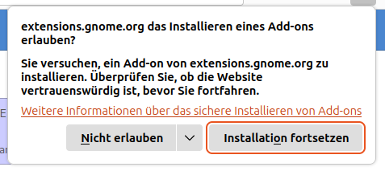
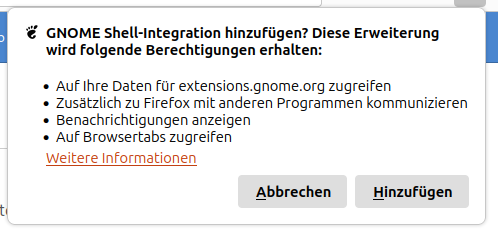
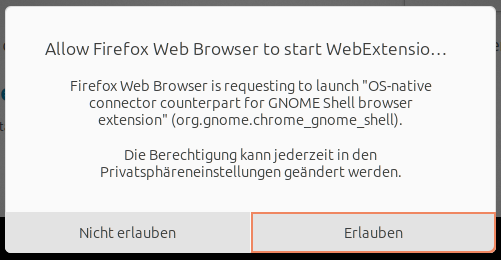
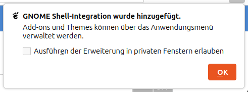
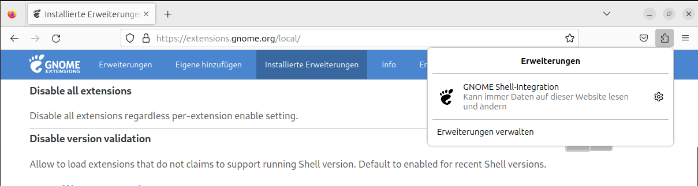
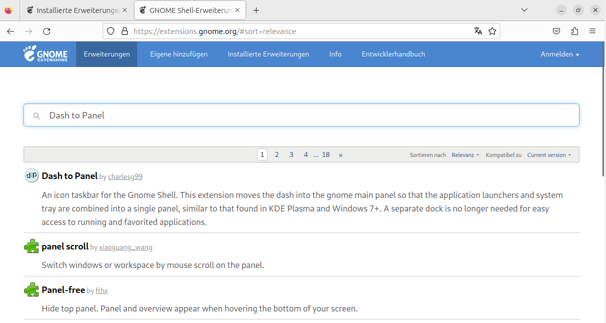
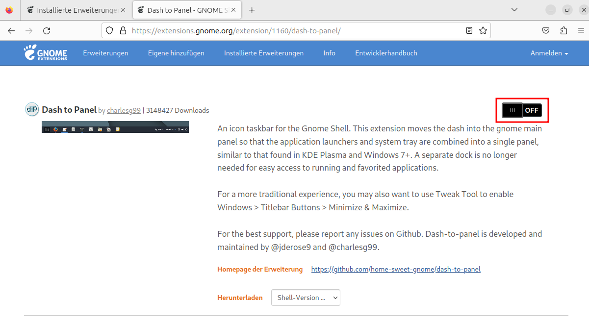
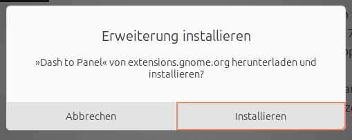
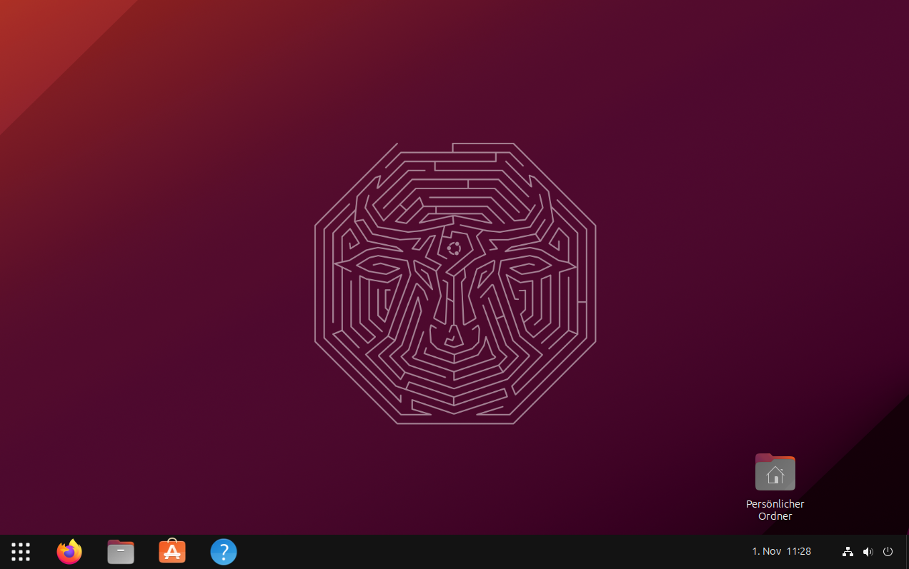

## Gnome Extensions

Die von uns hier installierte Oberfläche heißt _Gnome_ und Sie können Sie sehr vielseitig anpassen. Ein Mittel hierzu sind die sogenannten "Extensions", die man am einfachsten über ein Browser-Plugin verwaltet.

Damit die folgende Anleitung funktioniert müssen Sie entweder bereits die von uns [vorgeschlagenen Pakete installiert](installation-packages.md) haben oder folgendes Kommando im Terminal absetzen:

```console
$ sudo pacman -S gnome-browser-connector
```

Eine sinnvolle Erweiterung ist "Dash to Panel". Sie erlaubt es, die Oberfläche von Gnome etwas ähnlicher zu Windows oder macOS zu machen, sodass sich die Startleiste mit allen Informationen am unteren Rand des Bildschirms befinden und nicht wie im Standard an der linken Seite und oben.

Öffnen Sie den Browser _Firefox_ und navigieren Sie zur folgenden Seite: [https://extensions.gnome.org/local](https://extensions.gnome.org/local)

Klicken Sie auf der Seite "Click here to install browser extension" an.



Bestätigen Sie die beiden Abfragen






Nach der Installation sehen Sie rechts in der Ecke der Adressleiste des Browsers ein Puzzel-Symbol. Wenn Sie auf dieses klicken, sehen Sie das Gnome-Logo. Klicken Sie dieses an.



Suchen Sie nach "Dash To Panel" und klicken Sie den gefundenen Eintrag an.



Schalten Sie die Erweiterung durch Klick auf den Toggel-Button ein.



Erlauben Sie die Installation.



Ihr Desktop sollte jetzt mehr wie unter Windows oder macOS aussehen.



Auf demselben Weg können Sie weitere Extensions installieren. Der [Katalog](https://extensions.gnome.org) hält einiges bereit.

Interessant sind z.B.:

  * [Tactile](https://extensions.gnome.org/extension/4548/tactile/): Hiermit können Sie die Fenster auf dem Desktop schnell per Tastenkombination anordnen.
  * [AppIndicator and KStatusNotifierItemSupport](https://extensions.gnome.org/extension/615/appindicator-support/): Status-Icons in der unten rechten Ecke, wie man sie von Windows kennt.

[Zurück](readme.md)
